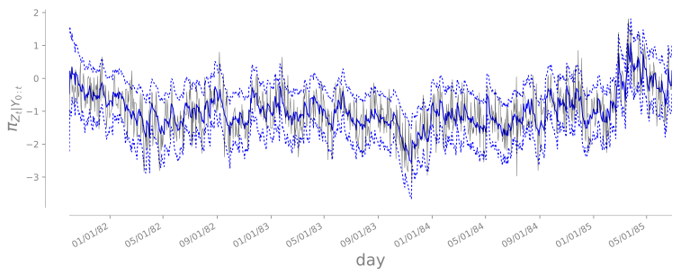
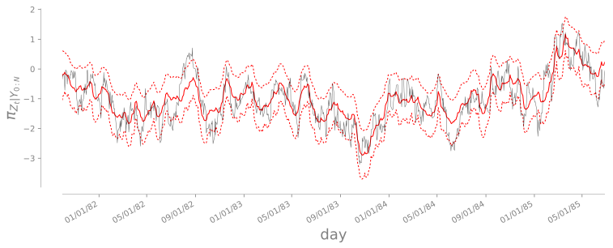
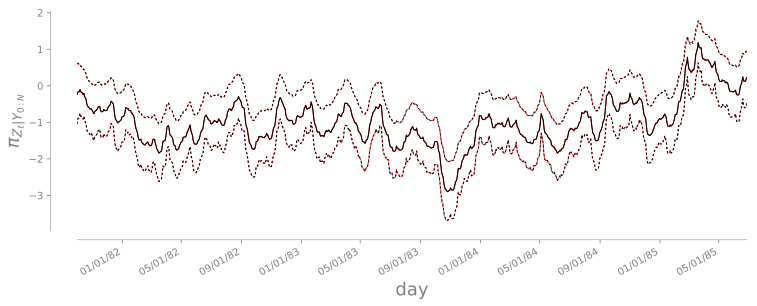

.. warning::

   Loading data structures using `pickle <https://docs.python.org/3.4/library/pickle.html>`_ or `dill <https://github.com/uqfoundation/dill>`_ is not safe against erroneous or maliciously constructed data. In order to avoid the possible injection of malicious data, we provide the `md5sum <https://en.wikipedia.org/wiki/Md5sum>`_ for each available file.

Stochastic volatility
=====================

We apply the sequential inference algorithm outlined `here <../../example-sequential-stocvol-6d.html>`_ to the exchange rate of different assets. 

We model the log-volatility :math:`{\bf Z}_{\Lambda}` of the return of a financial asset at times :math:`\Lambda=\{0,1,\ldots,n\}` with the autoregressive process

.. math::

   {\bf Z}_{k+1} = \mu + \phi ({\bf Z}_k - \mu) + \varepsilon_k \;, \qquad \varepsilon_k \sim \mathcal{N}(0,\sigma^2) \;, \quad \varepsilon_k {\perp\!\!\!\perp} {\bf Z}_k \\
   \qquad \left.{\bf Z}_0 \right\vert \mu,\sigma,\phi \sim \mathcal{N}\left(\mu, \frac{\sigma^2}{1-\phi^2}\right) \;, \qquad \mu \sim \mathcal{N}(0,1) \;\, \\
   \qquad \phi = 2 \frac{\exp(\phi^\star)}{1+\exp(\phi^\star)} - 1 \;, \qquad \phi^\star \sim \mathcal{N}(3,1) \;, \\
   \sigma^2 \sim \text{InvGamma}(\alpha=1, \beta=0.1) \;.

For :math:`k \in \Xi \subset \Lambda`, estimate parameters :math:`\Theta = (\mu,\phi)` and states :math:`\left\{ {\bf Z}_k \right\}`, given observations

.. math::

   {\bf Y}_k = \xi_k \exp\left(\frac{1}{2}{\bf Z}_k\right) \;, \qquad \xi_k \sim \mathcal{N}(0,1) \;, \quad \xi_k {\perp\!\!\!\perp} {\bf Z}_k \;.

Exchange rate GBP - USD
-----------------------

We consider here the exchange rates between British Pound (GBP) and US Dollar (USD). These data and results are part of the paper `TM4 <../../aa-references.html#spantini2017>`_.

State and parameters estimation 10/01/81 - 06/27/85
^^^^^^^^^^^^^^^^^^^^^^^^^^^^^^^^^^^^^^^^^^^^^^^^^^^

First we consider the problem of estimating the parameters :math:`\mu, \phi` and states :math:`{\bf Z}_{1:945}` of the stochastic volatility model using the 945 observations of the daily returns associated to the GBP-USD exchange rates from 10/01/81 till 06/27/85. We fix the variance of the dynamics to :math:`\sigma=1/4`.
The same problem has been analyzed also in `OR13 <../../aa-references.html#Durbin2000>`_ and `OR14 <../../aa-references.html#Rue2009>`_.
We provide a number of files which can be used to reproduce the results in `TM4 <../../aa-references.html#spantini2017>`_.

* `DurbinData.csv <https://www.dropbox.com/s/lhn3yuxbr8vlmtd/Durbin.csv?dl=1>`_ [md5sum: a8a223904ded9d3f19d4a3c5946541ed]: daily returns
* `Distribution.dill <https://www.dropbox.com/s/lactnq17jemi5mk/Distribution.dill?dl=1>`_ [md5sum: ad8fd058693939a81207ea812fb44fca]: :class:`SequentialHiddenMarkovChainDistribution<TransportMaps.Distributions.Decomposable.SequentialHiddenMarkovChainDistribution>` :math:`\pi\left( \left. \Theta, {\bf Z}_\Lambda \right\vert {\bf y}_\Xi \right) \propto \mathcal{L}\left({\bf y}_\Xi \left\vert \Theta, {\bf Z}_\Lambda\right.\right) \pi\left( \Theta, {\bf Z}_\Lambda \right)`
* `runner.sh <https://www.dropbox.com/s/914rfsz91cj2wp5/runner.sh?dl=1>`_ [md5sum: 1471af8891c113e9851c996fbbab374b]: script used to construct the sequential map and obatin all the results. The script was run in parallel on 8 machine for a total of 128 cores.
* `Sequential-map.dill <https://www.dropbox.com/s/3mq9lacumlq43uh/Sequential-map.dill?dl=1>`_ [md5sum: eb7b4d90cd020a2dd237671e61a0f80e]: this contains the output of the script `tmap-sequential-tm <../../cli/cli.html#tmap-sequential-tm>`_. It includes the base distribution :math:`\rho=\mathcal{N}(0,{\bf I})`, the target distribution :math:`\pi\left( \left. \Theta, {\bf Z}_\Lambda \right\vert {\bf y}_\Xi \right) \propto \mathcal{L}\left({\bf y}_\Xi \left\vert \Theta, {\bf Z}_\Lambda\right.\right) \pi\left( \Theta, {\bf Z}_\Lambda \right)`, the map :math:`T` such that :math:`T_\sharp \rho \approx \pi\left( \left. \Theta, {\bf Z}_\Lambda \right\vert {\bf y}_\Xi \right)`, and the :class:`TransportMapSmoother<TransportMaps.Algorithms.SequentialInference.TransportMapSmoother>` used for the construction.
* `Sequential-map-POST.dill <https://www.dropbox.com/s/bw2j72h0ehh0m87/Sequential-map-POST.dill?dl=1>`_ [md5sum: 50c66da9e5b74792db931ac53459e906]: data structure used as output of the script `tmap-sequential-postprocess <../../cli/cli.html#tmap-sequential-posprocess>`_.
* `Sequential-map-POST.dill.hdf5 <https://www.dropbox.com/s/zjmlwnzm5wawt3p/Sequential-map-POST.dill.hdf5?dl=1>`_ [md5sum: 1d0725ad889fe86f3e2f2c02fe7169b9]: dataset containing the output of `tmap-sequential-postprocess <../../cli/cli.html#tmap-sequential-posprocess>`_. The data is structured as follows:

  - ``filtering``: list of samples from the approximate filtering distributions :math:`\pi\left(\Theta, {\bf Z}_k \middle\vert {\bf y}_{1:k}\right)` for :math:`k\in\Lambda`.
  - ``metropolis-independent-proposal-samples/skip-10``: Monte Carlo Markov Chain :math:`10^5` long, obtained with :class:`MetropolisHastingsIndependentProposalsSampler<TransportMaps.Samplers.MetropolisHastingsIndependentProposalsSampler>`, by subsampling every 10 samples.
    
    - ``x``: Monte Carlo Markov Chain with invariant :math:`\pi\left( \Theta, {\bf Z}_\Lambda \middle\vert {\bf y}_\Xi \right)`.
    - ``s``: Monte Carlo Markov Chain with invariant :math:`T^\sharp \pi\left( \Theta, {\bf Z}_\Lambda \middle\vert {\bf y}_\Xi \right)`.

  - ``quadrature``: Monte Carlo samples from :math:`T_\sharp\rho \approx \pi\left( \Theta, {\bf Z}_\Lambda \middle\vert {\bf y}_\Xi \right)`.
  - ``vals_var_diag``: values :math:`\{\log\rho({\bf x}_i)\}` and :math:`\{\log T^\sharp\pi({\bf x}_i)\}` used to compute the `variance diagnostic <../../example-BOD-4d.html#Variance-diagnostic>`_ :math:`\mathbb{V}\left[\log\frac{\rho}{T^\sharp\pi}\right]`.
  - ``trim-%i``: postprocessing of the approximation of the trimmed distribution :math:`\pi\left( \Theta, {\bf Z}_{\Lambda<i}\, \middle\vert {\bf y}_{\Xi<i}\, \right)`.
    
    - ``metropolis-independent-proposal-samples/skip-10``: Monte Carlo Markov Chain :math:`10^5` long, obtained with :class:`MetropolisHastingsIndependentProposalsSampler<TransportMaps.Samplers.MetropolisHastingsIndependentProposalsSampler>`, by subsampling every 10 samples.
    - ``vals_var_diag``: values used to compute the variance diagnostic.

In the following we report some of the results obtained. For a complete treatment we refer to `TM4 <../../aa-references.html#spantini2017>`_. 

   Mean and :math:`\{5,95\}` percentiles of the approximate filtering marginals :math:`\pi\left({\bf Z}_k \middle\vert {\bf y}_{1:k}\right)` (blue) along with one realization (black)

   Mean and :math:`\{5,95\}` percentiles of the approximate smoothing marginals :math:`[T_\sharp\rho]_k \approx \pi\left({\bf Z}_k \middle\vert {\bf y}_\Xi\right)` (red) along with one realization (black)

   Mean and :math:`\{5,95\}` percentiles of the approximate (red) and exact (black) smoothing marginals obtained with the map :math:`T` and Markov Chain Monte Carlo respectively

.. figure:: Figures/DurbinData/filtering-marginals-timesteps_mu-3d.svg
   :align: center

   (xy)-axis: mean and :math:`\{5,25,40,60,75,95\}` percentiles of the approximate filtering marginal :math:`[T_\sharp\rho]_{\mu} \approx \pi\left(\mu\middle\vert {\bf y}_{1:k}\right)` of the hyper-parameter :math:`\mu`. 
   (xyz)-axis: for a subset steps :math:`k`, we show the density of the approximate (solid lines) and the exact (dashed lines) filtering marginal obtained with Markov Chain Monte Carlo
   

.. figure:: Figures/DurbinData/filtering-marginals-timesteps_phi-3d.svg
   :align: center

   (xy)-axis: mean and :math:`\{5,25,40,60,75,95\}` percentiles of the approximate filtering marginal :math:`[T_\sharp\rho]_{\phi} \approx \pi\left(\phi\middle\vert {\bf y}_{1:k}\right)` of the hyper-parameter :math:`\phi`. 
   (xyz)-axis: for a subset steps :math:`k`, we show the density of the approximate (solid lines) and the exact (dashed lines) filtering marginal obtained with Markov Chain Monte Carlo

.. figure:: Figures/DurbinData/posterior-data-predictive.svg
   :align: center
           
   (shaded) :math:`\{5,25,40,60,75,95\}` percentiles of the posterior predictive (conditioned on all the data). (dots) data.

Filtering and smoothing 10/01/1981 - 08/24/2017
^^^^^^^^^^^^^^^^^^^^^^^^^^^^^^^^^^^^^^^^^^^^^^^

Here we fix the hyper-parameters :math:`\mu,\phi` of the stochastic volatility model to the medians :math:`\mu=0.667` and :math:`\phi=0.879` found through the preceding analysis of the first 945 steps, and apply the `algorithm <../../example-sequential-stocvol-6d.html>`_ for filtering and smoothing on an extended dataset of 9009 observations from 10/01/1981 till 08/24/2017. This means that we will sequentially construct 9008 two dimensional maps in order to approximate the full posterior :math:`\pi\left({\bf Z}_{1:9009}\middle\vert {\bf y}_{1:9009}\right)` and the filtering distributions :math:`\pi\left({\bf Z}_{k}\middle\vert {\bf y}_{1:k}\right)` for :math:`k=1,\ldots,9009`. 
This setting is also described in `TM4 <../../aa-references.html#spantini2017>`_. Here we provide the dataset used and the results obtained.

* `GBP-USD.csv <https://www.dropbox.com/s/fnbp5w7ln7j4j7r/GBP-USD.csv?dl=1>`_ [md5sum: 195a260b45b113051756d1297f082714]: daily returns
* `Distribution.dill <https://www.dropbox.com/s/entn3osk32agobj/Distribution.dill?dl=1>`_ [md5sum: 65c4cc50ff8eb6200cfc373523dad46a]: :class:`SequentialHiddenMarkovChainDistribution<TransportMaps.Distributions.Decomposable.SequentialHiddenMarkovChainDistribution>` :math:`\pi\left({\bf Z}_\Lambda \middle\vert {\bf y}_\Xi \right) \propto \mathcal{L}\left({\bf y}_\Xi \middle\vert {\bf Z}_\Lambda\right) \pi\left( {\bf Z}_\Lambda \right)`
* `runner.sh <https://www.dropbox.com/s/z9xu074f6j2jqxu/runner.sh?dl=1>`_ [md5sum: 51de28a3588809bbe8965646b7a4d0a4]: script used to construct the sequential map and obatin all the results. The script was run in parallel on one machine with 10 cores.
* `Sequential-map.dill <https://www.dropbox.com/s/r27j5brlh2t343y/Sequential-map.dill?dl=1>`_ [md5sum: ecff7757ea414f045259e8e5caca903b]: this contains the output of the script `tmap-sequential-tm <../../cli/cli.html#tmap-sequential-tm>`_. It includes the base distribution :math:`\rho=\mathcal{N}(0,{\bf I})`, the target distribution :math:`\pi\left( {\bf Z}_\Lambda \middle\vert {\bf y}_\Xi \right) \propto \mathcal{L}\left({\bf y}_\Xi \middle\vert {\bf Z}_\Lambda\right) \pi\left( {\bf Z}_\Lambda \right)`, the map :math:`T` such that :math:`T_\sharp \rho \approx \pi\left( {\bf Z}_\Lambda \middle\vert {\bf y}_\Xi \right)`, and the :class:`TransportMapSmoother<TransportMaps.Algorithms.SequentialInference.TransportMapSmoother>` used for the construction.
* `Sequential-map-POST.dill <https://www.dropbox.com/s/qdji26wozfy2l3e/Sequential-map-POST.dill?dl=1>`_ [md5sum: 72a755383fba437e4dead6ff3e3d81e3]: data structure used as output of the script `tmap-sequential-postprocess <../../cli/cli.html#tmap-sequential-posprocess>`_.
* `Sequential-map-POST.dill.hdf5 <https://www.dropbox.com/s/xu4j4ca1lapxsm5/Sequential-map-POST.dill.hdf5?dl=1>`_ [md5sum: d1b5686c3680f623b8cba2764c92eb0c]: dataset containing the output of `tmap-sequential-postprocess <../../cli/cli.html#tmap-sequential-posprocess>`_. The data is structured as follows:

  - ``filtering``: list of samples from the approximate filtering distributions :math:`\pi\left({\bf Z}_k \middle\vert {\bf y}_{1:k}\right)` for :math:`k\in\Lambda`.
  - ``metropolis-independent-proposal-samples/skip-10``: Monte Carlo Markov Chain :math:`10^5` long, obtained with :class:`MetropolisHastingsIndependentProposalsSampler<TransportMaps.Samplers.MetropolisHastingsIndependentProposalsSampler>`, by subsampling every 10 samples.
    
    - ``x``: Monte Carlo Markov Chain with invariant :math:`\pi\left( {\bf Z}_\Lambda \middle\vert {\bf y}_\Xi \right)`.
    - ``s``: Monte Carlo Markov Chain with invariant :math:`T^\sharp \pi\left( {\bf Z}_\Lambda \middle\vert {\bf y}_\Xi \right)`.

  - ``quadrature``: Monte Carlo samples from :math:`T_\sharp\rho \approx \pi\left( {\bf Z}_\Lambda \middle\vert {\bf y}_\Xi \right)`.

The following images show the smoothing marginals at different timesteps. We makred some historical events to put this results into context. If you, by any chance, have a better historical insight on the evolution of the volatlity for certain periods, we would be happy to know it.

.. figure:: Figures/GBP-USD-cleared/smoothing-marginals-vs-unbiased-timesteps-chunk-0.svg
   :align: center

.. figure:: Figures/GBP-USD-cleared/smoothing-marginals-vs-unbiased-timesteps-chunk-1.svg
   :align: center

.. figure:: Figures/GBP-USD-cleared/smoothing-marginals-vs-unbiased-timesteps-chunk-2.svg
   :align: center

   Mean and :math:`\{5,95\}` percentiles of the approximate (red) and exact (black) smoothing marginals obtained with the map :math:`T` and Markov Chain Monte Carlo respectively

