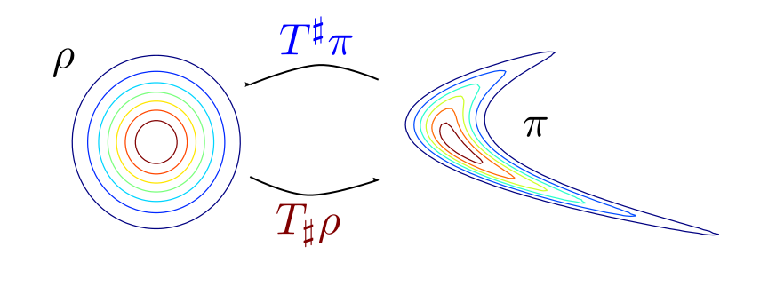
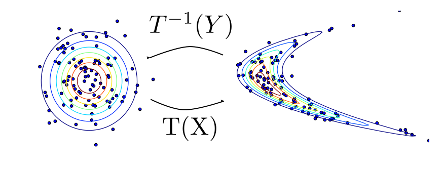

.. TransportMaps documentation master file, created by
   sphinx-quickstart on Thu Dec 17 16:03:14 2015.
   You can adapt this file completely to your liking, but it should at least
   contain the root `toctree` directive.

TransportMaps
=============

We use (transport) maps from :math:`\mathbb{R}^d` to :math:`\mathbb{R}^d` to represent transformations between probability distributions. These transformations lead to efficient algorithms for the solution of practical **inference problems**, or for the **estimation of densities from samples**.

For example, if :math:`Y \sim \nu_\pi` is a complex distribution and :math:`X \sim \nu_\rho` is an amenable distribution (e.g. standard normal) we look for a computable and invertible map :math:`T` such that :math:`Y = T(X)`. This allows us to apply the following change of variables

.. math::

   \int f(y) \pi(y) dy = \int f(T(x)) \rho(x) dx ;,

obtaining a tractable integral from an otherwise intractable one.

Software Downloads
------------------

+--------+----------------------------------------------------------------------------------+------------------------------------------------------------------------------------+--------------------------------------------------------------------------------------------+
|        | `Binary (PyPi) <https://pypi.python.org/pypi/TransportMaps>`_                    | `Public source (Bitbucket) <https://bitbucket.org/dabi86/transportmaps>`_          | `Private source (Bitbucket) <https://bitbucket.org/dabi86/transportmaps-private>`_         |
+--------+----------------------------------------------------------------------------------+------------------------------------------------------------------------------------+--------------------------------------------------------------------------------------------+
| Serial | .. image:: https://acdl.mit.edu/csi/buildStatus/icon?job=TransportMaps-pypi      | .. image:: https://acdl.mit.edu/csi/buildStatus/icon?job=TransportMaps-public      | .. image:: https://acdl.mit.edu/csi/buildStatus/icon?job=TransportMaps-private-master      |
|        |    :target: https://acdl.mit.edu/csi/buildStatus/icon?job=TransportMaps-pypi     |    :target: https://acdl.mit.edu/csi/buildStatus/icon?job=TransportMaps-public     |    :target: https://acdl.mit.edu/csi/buildStatus/icon?job=TransportMaps-private-master     |
+--------+----------------------------------------------------------------------------------+------------------------------------------------------------------------------------+--------------------------------------------------------------------------------------------+
| MPI    | .. image:: https://acdl.mit.edu/csi/buildStatus/icon?job=TransportMaps-pypi-mpi  | .. image:: https://acdl.mit.edu/csi/buildStatus/icon?job=TransportMaps-public-mpi  | .. image:: https://acdl.mit.edu/csi/buildStatus/icon?job=TransportMaps-private-master-mpi  |
|        |    :target: https://acdl.mit.edu/csi/buildStatus/icon?job=TransportMaps-pypi-mpi |    :target: https://acdl.mit.edu/csi/buildStatus/icon?job=TransportMaps-public-mpi |    :target: https://acdl.mit.edu/csi/buildStatus/icon?job=TransportMaps-private-master-mpi |
+--------+----------------------------------------------------------------------------------+------------------------------------------------------------------------------------+--------------------------------------------------------------------------------------------+

.. toctree::
   :hidden:
   :maxdepth: 1

   install
   tutorial
   case-studies
   api-TransportMaps
   aa-references
   credits
